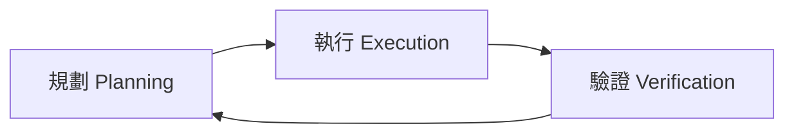

# 智能代理

Antigravity 的核心是 **智能代理** (Agent) — 能夠自主思考、規劃並執行複雜開發任務的 AI 助手。

## 代理優先理念

傳統 IDE 中，AI 只是輔助工具。在 Antigravity 中，代理被提升為核心角色：

| 傳統 IDE | Antigravity |
|----------|-------------|
| AI 作為輔助 | AI 作為核心 |
| 被動回應 | 主動規劃 |
| 單一任務 | 複雜工作流程 |
| 無法驗證 | 產出物驗證 |

## 代理如何運作

代理透過三個階段完成任務：

### 1. 規劃階段

- 研究程式碼庫
- 理解需求
- 設計解決方案
- 產生實作計畫

### 2. 執行階段

- 編寫程式碼
- 修改檔案
- 執行終端命令
- 操作瀏覽器

### 3. 驗證階段

- 執行測試
- 驗證結果
- 產生操作指南
- 記錄截圖與錄影

## 與代理互動

在代理側邊欄中，您可以：

- 📝 輸入自然語言請求
- 📋 審核實作計畫
- ✅ 批准或修改建議
- 💬 提供反饋

## 本章內容

- [模型](models.md) - 可用的 AI 模型
- [模式](modes.md) - 規劃、執行、驗證模式
- [設定](settings.md) - 代理行為設定
- [規則](rules.md) - 自定義代理規則
- [工作流程](workflows.md) - 自動化任務流程

---

> **提示**：代理會記住對話上下文，您可以連續下達相關指令。
