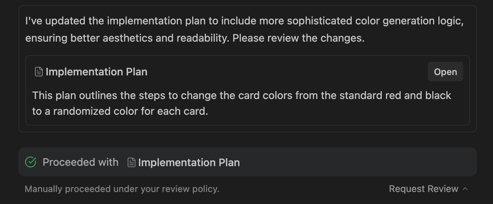

# Settings (設定)

您可以透過 Agent 的組態選項來調整其行為，包括 Artifacts 審查政策、Terminal 命令執行以及檔案存取權限。

## Overall Settings (通用設定)

### Artifact Review Policy (產出物審查政策)

*   **Always Proceed (總是繼續)**：Agent 在產生 Artifacts 後不會詢問審查，直接繼續後續任務。
    

*   **Request Review (請求審查)**：Agent 在執行 Implementation Plan 或關鍵 Artifacts 前，會先請求您的審查。
    

### Terminal Command Auto Execution (終端機命令自動執行)

*   **Request Review**: 所有 Terminal 命令在執行前都必須經過您的核准（除了已加入「Allowlist」的命令）。
*   **Always Proceed**: Agent 會自動執行命令，除非該命令在「Denylist」中。

### Agent Non-Workspace File Access (代理非工作空間檔案存取)
預設情況下，Agent 僅能存取 Workspace 目錄以及 `~/.antigravity/`。啟用此設定後，Agent 可以檢視並編輯這些邊界之外的檔案。

## Models & Context (模型與內容)

*   **Reasoning Models**: 您可以根據需要切換不同的模型（如 Gemini 3 Pro, Claude Sonnet 4.5, GPT-OSS）。
*   **Sticky Selection (黏性選擇)**: 在單一對話輪次中，您的 Model 選擇會保持生效直到任務完成或取消。

---
導覽：[<- Modes](modes.md) | [Rules ->](rules.md)

---

> **原文參考**：[antigravity.google/docs/agent-modes-settings](https://antigravity.google/docs/agent-modes-settings)
