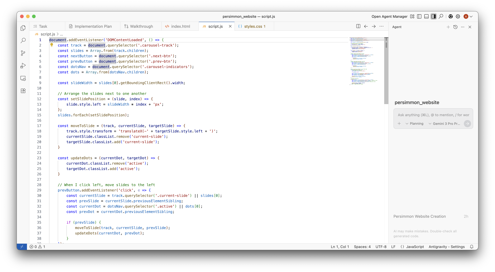

# Agent Side Panel (代理側邊欄)

Agent Side Panel 位於 Editor 右側，是您與 Agent 互動的主要介面。

## Key Features (主要功能)

*   **Conversation Management**: 啟動新對話、附加圖片背景資訊，以及切換 **Modes**。
*   **Model Selection**: 在不同的 Models（如 Gemini 3 Pro, Gemini 3 Flash）之間切換。
*   **Tracking Toolbar**: 輸入框上方的工具列會追蹤已開啟的檔案變更、執行中的 Terminal 進程以及活躍的 Artifacts。

---
導覽：[<- Commands](commands.md) | [Review Changes ->](review-changes.md)

---

> **原文參考**：[antigravity.google/docs/agent-side-panel](https://antigravity.google/docs/agent-side-panel)
