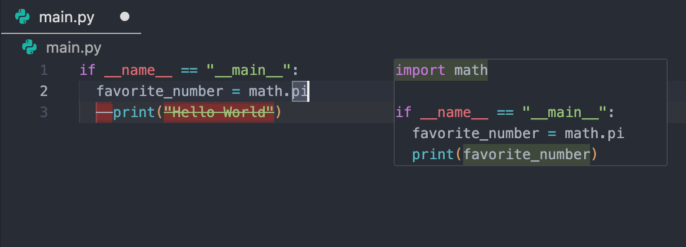

# Tabs & Navigation (分頁與導覽)

在 Antigravity 中，`Tab` 鍵是 AI 輔助程式編寫的核心體驗。

## Core Features (核心功能)

*   **Supercomplete (超級補全)**：在游標位置附近提供上下文相關的程式碼建議。
*   **Tab-to-Jump**: 讓您快速跳轉至 AI 建議的相關程式碼區段。
*   **Tab-to-Import**: 自動偵測缺失的 Imports，按下 `Tab` 即可立即新增。

透過這些功能，您可以大幅減少打字時間，並在複雜的 Codebase 中快速穿梭。

---
導覽：[<- Editor Overview](index.md) | [Commands ->](commands.md)

---

> **原文參考**：[antigravity.google/docs/tab](https://antigravity.google/docs/tab)
