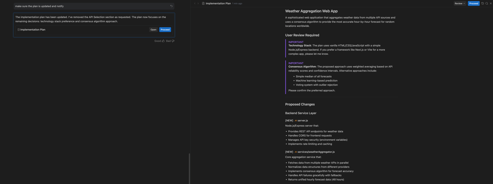

# Artifacts (產出物)

Artifacts 是在 Agent Workflow 中建立與更新的結構化、持久性文件。它們記錄了 Agent 的意圖、進度與最終結果。

## Main Artifact Types (主要產出物類型)

### 1. Task List (任務清單)
*   **Purpose**: 追蹤專案中所有子任務的狀態。
*   **Function**: 清晰呈現已完成、進行中與後續待辦事項的總覽。

### 2. Implementation Plan (實作計畫)
*   **Purpose**: 架構完成任務所需的技術變更。
*   **Function**: 在修改 Codebase 前由 Agent 生成，供使用者審查，確保提議的架構符合預期。

### 3. Walkthrough (操作指南)
*   **Purpose**: 解釋已完成的工作。
*   **Function**: 任務完成後提供變更細節，幫助使用者理解修改內容及其影響。

### 4. Screenshots (截圖)
*   **Purpose**: 提供視覺驗證。
*   **Function**: Agent 在執行期間擷取 Browser 或應用程式狀態，對 UI/UX 除錯與驗證至關重要。

### 5. Browser Recordings (瀏覽器錄影)
*   **Purpose**: 提供詳細的逐步視覺日誌。
*   **Function**: 自動錄製 WebP 影片，擷取 Agent 與 Browser 的互動過程，允許使用者回放並審核操作細項。

---
導覽：[<- MCP](mcp.md) | [Knowledge ->](knowledge.md)

---

> **原文參考**：[antigravity.google/docs/artifacts](https://antigravity.google/docs/artifacts)
